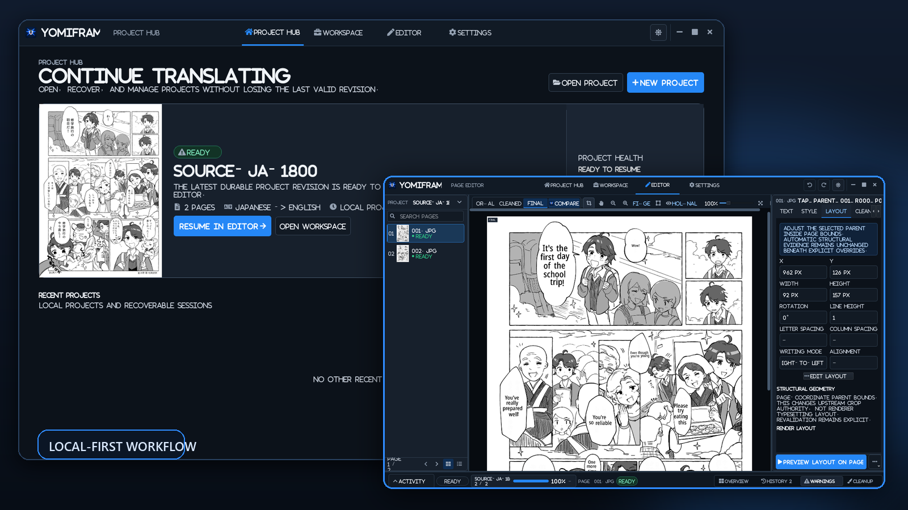
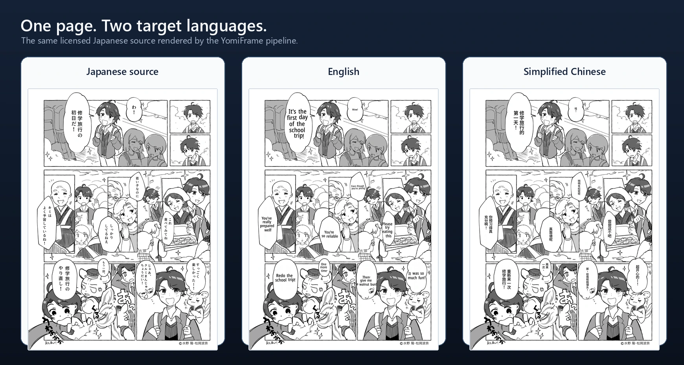
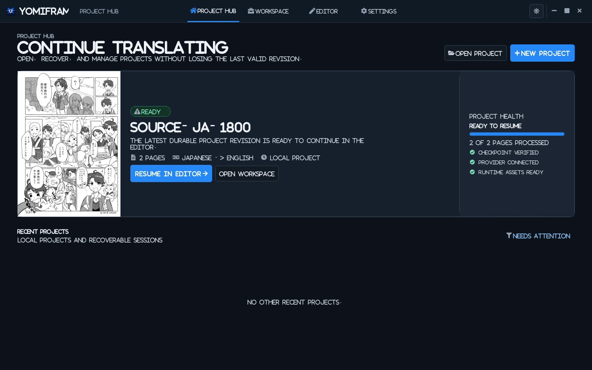
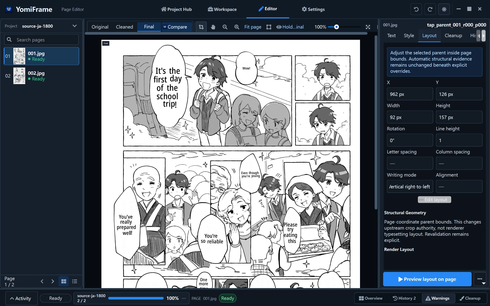

<p align="center">
  
</p>

<h1 align="center">YomiFrame</h1>

<p align="center">
  <strong>Local-first manga translation with a real editing workflow.</strong><br>
  Detect, read, translate, clean, typeset, review, and refine complete pages in one desktop application.
</p>

<p align="center">
  <a href="#install-from-source">Install from source</a> ·
  <a href="#see-the-result">See the result</a> ·
  <a href="#desktop-workflow">Desktop workflow</a> ·
  <a href="TECHNICAL.md">Technical documentation</a>
</p>

<p align="center">
  
</p>

## Translate manga without giving up control

YomiFrame turns source-language manga and comic pages into translated page
images while keeping every important decision visible and editable.

It combines:

- bubble and text-area planning
- scoped text detection and OCR
- chapter-level glossary and name continuity
- GGUF, Ollama, or DeepSeek translation providers
- source-text cleanup and inpainting
- language-aware text fitting and rendering
- evidence-backed text, geometry, style, cleanup, and topology edits
- project History with undo, redo, reset, and explicit Preview

The application is local-first. Detection, OCR, cleanup, rendering, project
state, and user edits stay on the machine. Translation can remain local through
GGUF or Ollama, or use an explicitly configured API provider.

## See the result

The comparison below uses the same licensed Japanese manga page for both target
languages. These are real YomiFrame pipeline outputs, not reconstructed mockups
or generated promotional art.

<p align="center">
  
</p>

<p align="center">
  <sub>
    Manga credit: © Takashi Mizuno, Hana Matsuoka 2024 ·
    <a href="https://note.com/mizn/n/n359a5ba575f1">original publication and reuse terms</a> ·
    <a href="assets/showcase/ATTRIBUTION.md">full attribution</a>
  </sub>
</p>

## Why YomiFrame

### A complete page workflow

YomiFrame does more than replace strings. It maintains page order, text-area
semantics, source evidence, cleanup scope, translation ownership, render
geometry, and durable project state across the whole workflow.

### Editing that preserves evidence

Automatic pipeline records remain immutable. User changes are stored as typed,
append-only edits and projected into an effective page only when needed. Text
replacement, OCR revision, merge, split, reading order, cleanup, style, layout,
glossary, undo, redo, and reset stay reviewable.

### Local models without a black box

Use a local GGUF model, an Ollama endpoint, or a validated DeepSeek profile.
Provider activation is explicit, credentials resolve through the platform
credential store or an explicit environment-variable reference, and Start
remains fail-closed until the selected configuration is ready.

### Rendering for real manga layouts

The renderer preserves complete translated text, supports CJK and Latin
presentation policies, retains expressive punctuation, respects source-relative
style evidence, and keeps every rendered parent inside its authorized page
domain.

## Desktop workflow

| Project Hub | Page Editor |
| --- | --- |
|  |  |
| Open, recover, inspect, and resume durable projects. | Compare source and final pages, inspect parents, and apply reversible edits. |

A normal project moves through four user-facing stages:

1. **Import** — choose source pages and a destination.
2. **Translate** — select languages, OCR, and a validated translation provider.
3. **Refine** — review evidence-backed parents and edit text, cleanup, style,
   layout, topology, or glossary state.
4. **Export** — Preview explicitly, then keep the final rendered pages and
   durable project for later revision.

## Install from source

YomiFrame is currently distributed from source. Python 3.10 is the supported
interpreter.

### Windows

Requirements:

- Windows 10 or newer
- Git and Conda
- optional NVIDIA CUDA for supported local workloads
- enough disk space for the selected OCR, cleanup, font, and translation models

```powershell
git clone https://github.com/barbing/YomiFrame-LLM_Manga_Translator.git
cd YomiFrame-LLM_Manga_Translator

conda create -n manga-llm python=3.10 -y
conda activate manga-llm
python -m pip install --upgrade pip
python -m pip install -r requirements.txt
python -m app.main
```

The Windows requirements retain a CUDA-oriented ONNX Runtime branch and an
explicit CPU fallback. Match CUDA-enabled Torch and llama.cpp builds to the
installed driver/toolkit when GPU execution is required.

### Apple Silicon macOS

The repository-owned environment installs Python 3.10, PyICU/ICU,
Conda-native llama.cpp packages, and the remaining Python dependencies without
downloading Windows CUDA archives.

```bash
git clone https://github.com/barbing/YomiFrame-LLM_Manga_Translator.git
cd YomiFrame-LLM_Manga_Translator

conda env create -f environments/macos.yml
conda activate manga-llm
python -m app.main
```

Update an existing environment with:

```bash
conda env update -n manga-llm -f environments/macos.yml --prune
```

On Apple Silicon, supported runtimes prefer MPS, CoreML, and Metal and record
their selected backend or CPU fallback. This is a source workflow; a signed,
notarized, packaged macOS application is not currently claimed.

## Translation providers

| Provider | Runs where | Validation |
| --- | --- | --- |
| GGUF local | On the local machine | Readable model path and runtime capability |
| Ollama | Local or user-managed endpoint | Endpoint and installed model |
| DeepSeek | Official API endpoint | Connection test, model, and secure credential link |

Configure providers in **Settings > Providers**. Test the profile, choose
**Use for translation**, and apply the settings. Credentials resolve through
Windows Credential Manager, macOS Keychain, or an explicit environment-variable
reference; portable and project settings retain only the opaque reference.

## Runtime assets

Open **Settings > Runtime assets** and choose **Verify all** for a model-free
local check. The fixed catalog covers detection, bubble planning, PaddleOCR-VL,
MangaOCR, cleanup, Japanese NER, font detection, Noto CJK fonts, and PyICU/ICU.

Managed downloads remain available per asset row. Translation models are
user-selected provider assets rather than implicit pipeline downloads.

<details>
<summary><strong>Model layout and offline preparation</strong></summary>

For a local GGUF provider, place one or more models anywhere under `models/`
and select the desired file from **Settings > Providers**.

```text
models/
  qwen/
    model.gguf
  sakura/
    model.gguf
```

Large models are not bundled into a packaged application folder automatically.
For offline use, prepare the selected models and required OCR or cleanup caches
before starting the run.

</details>

## Platform status

| Path | Current status |
| --- | --- |
| Windows source | Primary locally validated workflow |
| Apple Silicon macOS source | Supported environment and platform contracts; broader live-hardware acceptance is ongoing |
| Windows packaged folder | PyInstaller recipe available in [BUILD_EXE.md](BUILD_EXE.md) |
| macOS packaged application | Not currently provided or claimed |

## Architecture in brief

```text
Import
  -> text-area planning
  -> scoped detection and OCR
  -> root / parent / child hierarchy
  -> parent execution bundles
  -> glossary-aware translation
  -> authorized cleanup
  -> source-style observation and arbitration
  -> language-aware typesetting
  -> page composition
  -> atomic page and style-cache persistence
  -> durable project and edit history
```

Each stage has one responsibility. The GUI cannot rewrite detector, OCR,
translation, cleanup, style, eligibility, renderer, or page-order algorithms to
make an edit appear successful. User topology remains mapped to real pipeline
evidence, and automated parent bundles remain immutable.

For the full public ownership model, platform contracts, persistence rules, and
validation policy, see the [technical overview](TECHNICAL.md).

## Build a Windows application folder

The checked-in PyInstaller specification and bundled ICU workflow are
Windows-only.

```powershell
conda activate manga-llm
powershell -ExecutionPolicy Bypass -File .\scripts\deployment\install_icu4c_pyicu_windows.ps1
pip install pyinstaller
pyinstaller manga_translator.spec
```

The resulting folder is written to `dist/YomiFrame/`. See
[BUILD_EXE.md](BUILD_EXE.md) for the native runtime and validation contract.

## Development and validation

YomiFrame is a visual translation tool. Counters and JSON reports are useful,
but final acceptance requires inspecting the actual source, cleaned, and
rendered pages.

Validation must match the changed owner and the claim being made. Syntax and
unit checks are supporting evidence; output-affecting changes also require the
runtime and visual evidence described in [TECHNICAL.md](TECHNICAL.md). Bare
repository-wide `pytest` is not release evidence.

## License and showcase material

Repository code is provided under [LICENSE](LICENSE).

The Touristship manga used in the screenshots is separately credited
`© Takashi Mizuno, Hana Matsuoka 2024` and is reused under the
Attribution-ShareAlike terms stated by its
[original publication](https://note.com/mizn/n/n359a5ba575f1). Derived
showcase files and their modification notes are documented in
[assets/showcase/ATTRIBUTION.md](assets/showcase/ATTRIBUTION.md).
