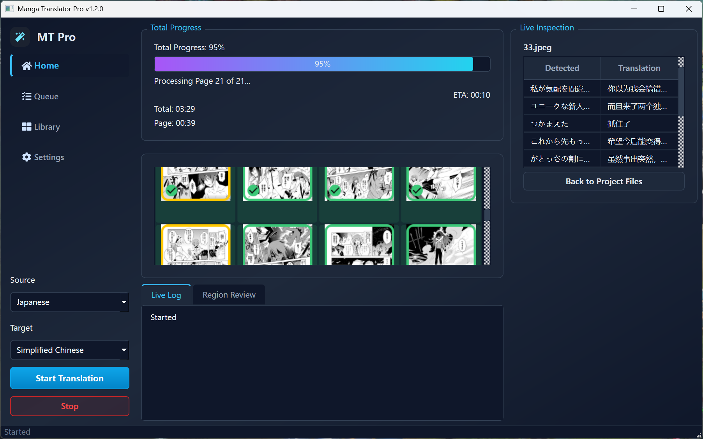

<p align="center">
  
</p>

# YomiFrame

YomiFrame is a Windows and macOS source application for local manga and comic translation. It combines page analysis, OCR, glossary memory, local or API translation, source-text cleanup, and final text rendering into one local-first workflow. Packaged desktop builds currently remain Windows-only.



## What YomiFrame Does

YomiFrame helps turn source-language manga pages into translated page images while preserving the visual structure of the original page.

It is designed to handle:

- speech bubbles
- narration boxes
- captions and background signs
- title or cover text when appropriate
- SFX and decorative lettering that should usually be preserved
- chapter-level name and terminology consistency
- local cleanup/inpainting of translated text areas
- final text placement back into the page

The project is aimed at practical local use. It favors deterministic routing, explicit fallbacks, and reviewable output over opaque cloud-only processing.

## Quick Start

### Requirements

- Windows 10 or newer, or Apple Silicon macOS for the source path described below
- Git and Conda; Python 3.10 is the supported interpreter
- Enough disk space for OCR, detection, cleanup, font, and optional local translation models
- Optional NVIDIA CUDA on Windows; Apple acceleration uses MPS, CoreML, and Metal when each runtime supports it

### Windows Source Setup

`requirements.txt` retains the Windows CUDA-oriented ONNX Runtime branch and a CPU fallback for runtimes that cannot activate CUDA.

```powershell
git clone https://github.com/barbing/YomiFrame-LLM_Manga_Translator.git
cd YomiFrame-LLM_Manga_Translator

conda create -n manga-llm python=3.10 -y
conda activate manga-llm
python -m pip install --upgrade pip
python -m pip install -r requirements.txt
python -m app.main
```

Match CUDA-enabled Torch and llama.cpp builds to the installed driver/toolkit when GPU execution is required. ONNX runtimes prefer CUDA and retain the CPU execution provider as an explicit fallback.

### macOS Source Setup

The repository-owned Mac environment installs Python 3.10, PyICU/ICU, pinned
Conda-native `llama-server` and `llama-cpp-python` builds, and the remaining
Python dependencies. It does not download Windows CUDA archives or compile
llama.cpp through pip.

```bash
git clone https://github.com/barbing/YomiFrame-LLM_Manga_Translator.git
cd YomiFrame-LLM_Manga_Translator

conda env create -f environments/macos.yml
conda activate manga-llm
python -m app.main
```

If the environment already exists, update it with:

```bash
conda env update -n manga-llm -f environments/macos.yml --prune
```

On Apple Silicon, Torch prefers MPS, ONNX Runtime prefers CoreML, and native llama.cpp uses Metal. Paddle's `llama-server` and GGUF translation's `llama-cpp-python` extension are probed independently because they can have different build capabilities. Unsupported runtimes fall back to CPU and record the selected backend and reason. Resource admission uses the recommended Metal working set plus available unified system memory; it does not require `nvidia-smi`.

The default Conda path does not require an Xcode source build. Developers who
intentionally replace the pinned llama packages with a pip source build must
install Xcode Command Line Tools first.

### Runtime Asset Verification

The app publishes the runtime catalog after first paint without importing model
frameworks or starting a model server. Open **Settings > Runtime assets** and
choose **Verify all** for a model-free local check. Start blocks only when a
current check proves that an asset selected by the compiled run is missing;
unselected alternatives do not block, and an unchecked runtime remains owned by
the normal fail-closed stage startup. The catalog covers nine fixed families:

1. ComicTextDetector
2. bubble detection
3. PaddleOCR-VL model/projector and platform-native llama.cpp runtime
4. MangaOCR
5. cleanup inpainting
6. Japanese NER
7. YuzuMarker font detection
8. Noto CJK font pack
9. PyICU/ICU

Windows CPython 3.10 x64 can install the SHA-256-pinned private PyICU runtime from the versioned `runtime-dependencies-v1` release. macOS validates PyICU 2.16.2 / ICU 78.3 from the active `manga-llm` Conda environment. Runtime paths are shown using the current platform's standard application-data location.

Managed model downloads remain available per catalog row. On macOS,
PaddleOCR-VL downloads only the GGUF model and projector. If its native
executable is missing, update the pinned environment from the repository root:
`conda env update -n manga-llm -f environments/macos.yml --prune`.

### Translation Provider Setup

YomiFrame preserves the existing GGUF and Ollama translation paths and also
supports authenticated DeepSeek profiles. Configure them in **Settings >
Providers**. The workflow is explicit: create or select a profile, enter its
public configuration, choose **Test provider**, then choose **Use for
translation** after validation succeeds. Workspace **Start** remains disabled
until the selected profile is validated.

For GGUF models:

1. Create a `models` folder if it does not already exist.
2. Put one or more `.gguf` model files anywhere under that folder.
3. In **Settings > Providers**, create a GGUF local profile, browse to the file,
   and test it. Validation checks that the `.gguf` file is readable without
   loading the model.
4. Choose **Use for translation**, then apply the settings.

Example layout:

```text
models/
  qwen/
    model.gguf
  sakura/
    model.gguf
```

For Ollama:

1. Install and start Ollama separately.
2. Pull a translation-capable model.
3. In **Settings > Providers**, enter the Ollama endpoint and installed model.
4. Test the profile, choose **Use for translation**, and apply the settings.

For DeepSeek, create a DeepSeek API profile, keep the official API endpoint,
select a currently available model, and choose **Test and link credential**.
The API key is held transiently for the connection test and is saved only after
a successful result and explicit confirmation. Windows uses Windows Credential
Manager; macOS uses Keychain through the system keyring. Portable settings
contain only an opaque credential reference, and save failures remain visible
in the provider panel and status bar.

### Build A Windows App Folder

The checked-in PyInstaller specification and bundled private ICU workflow are
Windows-only. The macOS support described above is a source/Conda workflow; no
signed, notarized, or packaged macOS application is currently claimed.

To package the app with PyInstaller:

```powershell
conda activate manga-llm
powershell -ExecutionPolicy Bypass -File .\scripts\deployment\install_icu4c_pyicu_windows.ps1
pip install pyinstaller
pyinstaller manga_translator.spec
```

The installer command in this build recipe is maintainer-only: it reproducibly
builds the native artifact consumed by the startup downloader and supplies the
private files required by PyInstaller. End users do not run it. The onedir
package carries its own ICU runtime and does not depend on a system or Qt ICU
installation. See `BUILD_EXE.md` for the artifact and validation contract.

The packaged app is written to:

```text
dist/YomiFrame/
```

Run:

```text
dist/YomiFrame/YomiFrame.exe
```

Large model files are not bundled into the executable folder automatically. For an offline package, copy the prepared `models` folder into `dist/YomiFrame/` and make sure any required Hugging Face, OCR, or cleanup inpainting caches are already available on the target machine.

## Current Architecture

YomiFrame now uses a specialized modular architecture rather than a single monolithic detection/OCR/rendering pass.

The current conceptual pipeline is:

```text
Page import
  -> optional prescan and glossary memory
  -> BubbleDetection and TextAreaPlan semantic planning
  -> scoped text detection and foreground segmentation
  -> OCR source capture
  -> root / parent / child text-block hierarchy
  -> ParentExecutionBundle handoff
  -> semantic routing
  -> parent-keyed glossary-aware translation
  -> parent-keyed source-glyph, cleanup, and render-eligibility contracts
  -> source-text cleanup and inpainting on the pre-render image
  -> parent-bounded font selection and text fitting
  -> final page rendering from parent execution units
  -> project/output persistence
```

Each stage has a distinct responsibility. BubbleDetection and TextAreaPlan decide what kind of visible text is present. The text detector and segmentation stages supply text geometry and pixels. OCR reads source text from approved parent-owned areas. The hierarchy stage separates physical root containers, parent translation obligations, and child source evidence. `ParentExecutionBundle` then becomes the parent-keyed execution contract consumed by translation, cleanup, render eligibility, and rendering.

This separation is important because manga pages contain many things that look like text but should not all be translated or erased. SFX, decorative lettering, artwork, and uncertain regions must not be treated the same way as normal dialogue or narration.

## Main Subsystems

### Desktop Workflow

The production desktop app uses one project-centered GUI-7 shell with four
surfaces: Project Hub, Translation Workspace, Page Editor, and Settings and
Providers. It provides the normal user workflow:

- choose input and output folders
- choose source and target languages
- see imported pages immediately in the Workspace queue and selected source
  image in the Page Editor
- configure, test, and activate a translation provider
- run translation jobs
- monitor progress
- review pages and evidence-backed parents
- apply reversible parent, text, cleanup, style, layout, glossary, and History
  edits, then invoke Preview explicitly

User editing never changes detector, OCR, translation, cleanup, style,
eligibility, or renderer algorithms. A custom scope starts as pending workflow
intent and obtains source text only from an explicit OCR revision. Merge and
Split retain exact immutable detected-parent identities, bboxes, OCR text,
reading order, and already admitted render evidence. Typed source or target text
can override only an existing mapped/selected-revision parent; entering text
cannot create or render a parent by itself.

### Model and Asset Management

YomiFrame uses local model assets and local caches where possible. Startup checks are intended to make fixed runtime assets available before translation begins, avoiding surprise downloads during active processing.

The main asset families are:

- bubble/text-area detection models
- root/parent semantic bubble evidence models
- text detection and segmentation models
- OCR models, including both PaddleOCR-VL and MangaOCR
- the fixed cleanup inpainting model
- NLP resources used by name extraction
- user-selected local translation models

Translation models are treated separately from fixed runtime assets. For example, a GGUF translation model or an Ollama model is a user-selected translation backend, while OCR and detection models are pipeline assets.
Pre-download coverage means the asset is available for offline or selectable use; it does not by itself make that model part of the recommended default workflow.

### Prescan and Name Memory

For chapter or volume translation, YomiFrame can prescan pages before translation. The prescan builds lightweight name and terminology memory so that repeated names, aliases, titles, and forms of address are translated more consistently.

This is not just a flat glossary. The name-memory layer is intended to connect canonical names with aliases, nicknames, honorific forms, and recurring terms across a chapter.

### Bubble and Text-Area Planning

Manga pages contain speech bubbles, narration, background labels, titles, SFX, decorative lettering, and art marks. YomiFrame uses a dedicated planning stage to classify these visual text areas before downstream cleanup and translation.

The planner is responsible for separating:

- dialogue that should be translated
- narration or caption text that should be translated
- background or title text that should be translated when appropriate
- SFX/decorative text that should usually be preserved
- art or non-text that must not be erased
- uncertain material that should remain review-only

This is a central difference between the current architecture and the older monolithic pipeline. Downstream modules should consume the planner's decision and the finalized parent execution contract rather than inventing their own semantic classification.

### Scoped Text Detection and OCR

After text-area planning, text detection and foreground segmentation run inside approved or review-eligible scopes. This keeps the detector focused on areas where text is expected and helps avoid routing decorative or non-text regions through normal translation.

OCR reads source text for parent-owned regions. The selectable OCR engines are PaddleOCR-VL and MangaOCR; PaddleOCR-VL is the default and MangaOCR is retained for explicit user choice. OCR engines are not supposed to silently switch during a run. OCR quality remains a major upstream dependency: if OCR misses, fragments, or corrupts text, translation and rendering quality will suffer.

### Root / Parent / Child Ownership

Manga text is often split into multiple detector fragments even when it visually belongs to one utterance. YomiFrame uses an explicit root / parent / child hierarchy to keep these relationships stable:

- root nodes represent physical text containers, such as a speech bubble, narration area, or background text area
- parent nodes represent the actual text obligations that should be translated, cleaned, and rendered as coherent units
- child nodes represent implementation-derived source evidence, such as detector fragments and OCR segments

This helps prevent:

- duplicate translations
- tiny fragment translations
- missing child text
- separate renderings inside one bubble
- mistranslation caused by losing surrounding context

After the hierarchy is finalized, `ParentExecutionBundle` records carry the parent id, root id, source text, execution region, cleanup target, render allowed area, represented children, source-glyph ids, cleanup ids, render ids, OCR provenance, and style hints. Source regions remain evidence; the parent execution bundle is the normal downstream execution unit.

The GUI edit ledger does not rewrite those bundles. Evidence-backed user
topology stores references to the exact automatic parents/bundles and their OCR
and geometry facts. A mapped Merge can present several immutable source parents
as one user parent, and a mapped Split can partition those source members
without cutting, duplicating, or inventing evidence. History simply changes
which typed mapping/edit is active.

### Translation

YomiFrame is built around local translation. The current recommended path is a local GGUF backend, with Ollama available as an alternate local backend.

Translation uses:

- parent-owned OCR source text
- source and target language settings
- parent/root context and reading order
- glossary/name-memory context
- semantic eligibility from the planning stage

The translation stage should not translate protected SFX, art, unknown review regions, or ungrounded text just because OCR text exists.

### Cleanup and Inpainting

Cleanup removes source text only where the pipeline has authorized that source text for translation and cleanup. It should preserve artwork, SFX, decorative lettering, and uncertain regions.

The cleanup subsystem uses:

- parent execution bundles
- source-glyph evidence
- text-pixel segmentation
- cleanup-job records
- foreground and erase masks
- cleanup planning
- inpainting or fill backends
- proof/audit evidence

The cleanup module is a consumer of upstream decisions. It should not decide on its own whether a region is dialogue, narration, SFX, decorative text, or art. It creates and runs cleanup contracts keyed back to the parent execution bundle, then commits successful cleanup to the pre-render image.

### Rendering

Rendering places translated text back into the cleaned page. The current production path renders parent execution bundles, using each bundle's execution region and render style contract as the layout input. It handles font selection, wrapping, fitting, layout orientation, and final composition.

The renderer must preserve the complete translated text. If text cannot fit cleanly, that should be visible as a review or layout issue rather than silently dropping content. The renderer is not the cleanup owner; it consumes cleanup results and render-eligibility decisions.

## Recommended Local Workflow

For normal use:

1. Prepare input pages in a folder.
2. Start YomiFrame.
3. Choose input and output folders. Supported source images immediately appear
   as naturally ordered queued pages with thumbnails; selecting a page opens its
   source image in the Page Editor before the pipeline runs.
4. Select source and target languages.
5. In **Settings > Providers**, test the desired GGUF, Ollama, or DeepSeek
   profile and choose **Use for translation**. A profile whose current
   configuration has not passed validation cannot enable Start.
6. Set OCR options and, if needed, glossary/name memory for chapter or volume
   work.
7. Treat **Output Defaults** as fallback output presentation only. Detected
   per-parent style and explicit user style/layout edits remain authoritative.
8. Run translation.
9. Review output pages and parent evidence in the Page Editor.
10. Use custom-scope OCR, Merge, or Split when topology needs correction; use
   text fields only as overrides on the resulting evidence-backed parent.
11. Preview explicitly and review dialogue completeness, source-text cleanup,
    and rendered text fit before relying on edited output.

For development validation, use a real page set rather than only checking logs or metadata. Visual correctness must be judged from the actual images.

## Runtime Expectations

YomiFrame is intended for local Windows and macOS source use. Windows live CUDA execution still requires validation on a Windows host; the Apple Silicon source path uses the backend and fallback reporting described above. The default workflow should remain practical on a local machine and does not require a cloud service unless an API provider such as DeepSeek is selected.

General expectations:

- local model assets should be reused where possible
- fallbacks should be explicit and visible
- translation quality should not come at the cost of unbounded runtime
- average processing time should stay within practical local limits
- heavy optional paths should remain optional unless explicitly promoted

## Outputs

A typical run writes:

- translated page images
- project state for later review or rerendering
- glossary/style-guide state when enabled
- debug or validation artifacts when the selected workflow produces them

Project state is important because it records page regions, parent execution bundles, root/parent/child hierarchy metadata, OCR text, translations, cleanup and render metadata, and review information. It is the bridge between translation, review, rerendering, and diagnostics.

## Validation Philosophy

YomiFrame is a visual translation tool, so final quality cannot be proven by counters alone.

Automated summaries, JSON reports, reviewer metrics, and contact sheets are useful for finding candidates, but acceptance requires direct visual review of the relevant source and output images.

Important validation questions include:

- Was all normal dialogue translated?
- Was narration or meaningful background text handled correctly?
- Were SFX/decorative/art regions preserved when they should be?
- Was source text actually removed where translated text was rendered?
- Did cleanup damage bubble borders or artwork?
- Does the rendered text include the full translation?
- Is the page readable as a manga page, not just technically processed?

## Development Principles

- Keep module ownership clear.
- Prefer deterministic contracts over hidden heuristic fallbacks.
- Preserve SFX, decorative text, and artwork unless a feature explicitly handles them.
- Diagnose the owning stage before editing code.
- Treat OCR, translation, cleanup, and rendering as separate failure domains.
- Validate visual changes with images, not only metadata.
- Keep the default workflow practical for local use.

## Technical Details

Detailed implementation notes, module boundaries, authorization contracts, cache behavior, and validation mechanics are maintained in `TECHNICAL.md`.

## License

GPL-3.0. See `LICENSE`.
